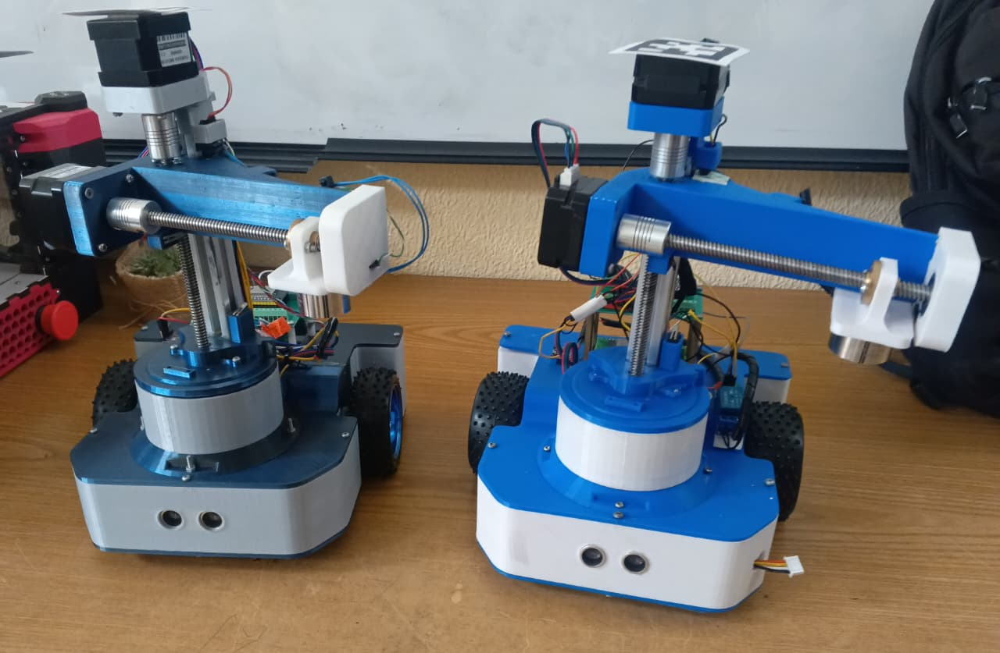
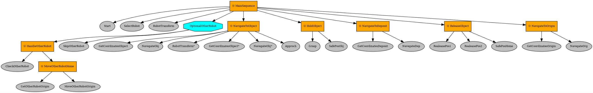
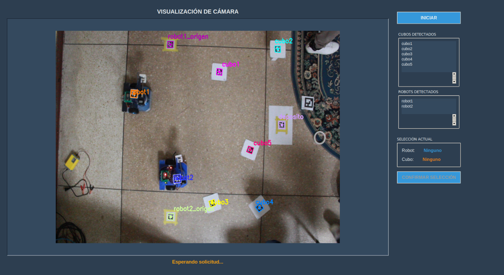
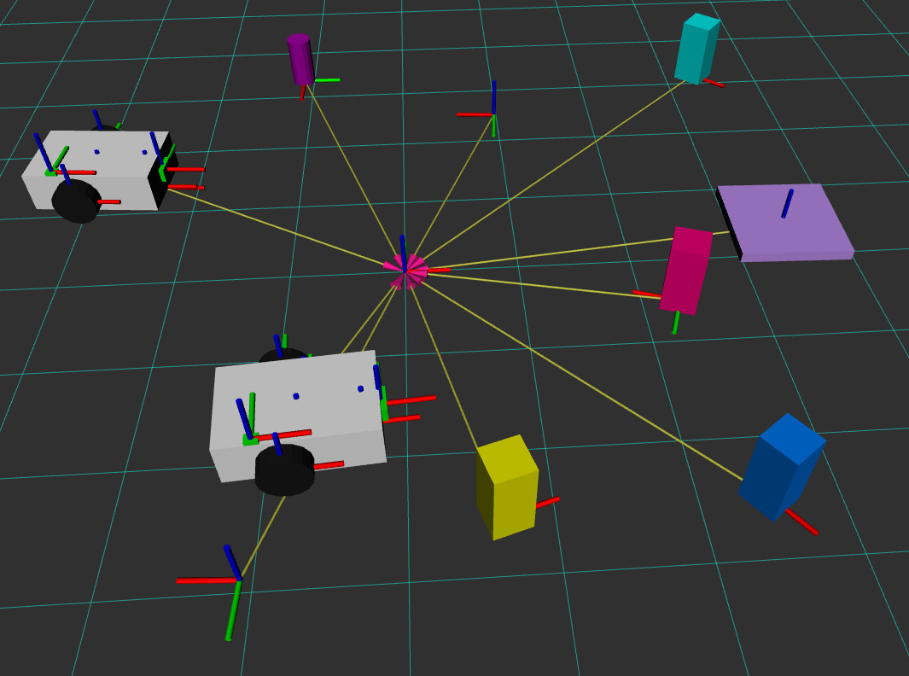

# MANEJO MULTIROBOT CON ROS 2

Control y visualización de 2 robots móviles diferenciales y 2 robots cilíndricos con ROS 2.

## Descripción del Proyecto

Este proyecto implementa un sistema de control para múltiples robots (2 robots móviles diferenciales y 2 robots manipuladores cilíndricos) utilizando ROS 2 (Robot Operating System 2). El sistema utiliza visión por computadora mediante una cámara y detección de AprilTags para localizar robots, objetos y puntos de interés en el entorno.

El sistema está diseñado para realizar tareas autónomas de manipulación y transporte de objetos, utilizando árboles de comportamiento (Behavior Trees) para coordinar las acciones de múltiples robots de manera eficiente.

## Características principales

- Control multi-robot coordinado con ROS 2.
- Detección y localización de cubos, depósitos y orígenes mediante una cámara (apriltags / detección personalizada).
- Interfaz gráfica para monitoreo y control.
- Visualización en RViz de estados, frames y trayectorias.
- Behavior Tree para la lógica de alto nivel.
- Navegación autónoma para robots móviles.
- Control preciso de brazos robóticos.
- Integración con micro-ROS Agent para comunicación en tiempo real con microcontroladores ESP32.

## Requisitos del Sistema
### Hardware
- 2 robots móviles diferenciales
- 2 robots manipuladores cilíndricos
- Cámara compatible con gPhoto2
- Procesador Intel i7 o superior (probado con i7)
- Microcontroladores ESP32 en los robots

### Software
- ROS 2 (probado en Ubuntu 22.04 + ROS 2 Humble — ajuste según su entorno).
- micro-ROS-Agent: [micro-ROS-Agent](https://github.com/micro-ROS/micro-ROS-Agent.git "micro-ROS-Agent")
- Python 3.8+
- OpenCV
- ffmpeg, gphoto2 y v4l2loopback para crear y alimentar la cámara virtual (si usa la cámara física con gphoto2).

## Instalación y Configuración

1. Clonar el repositorio:

        git clone https://github.com/LuisLuar/Proyecto_Robotica.git

2. Instalar dependencias de ROS 2:

        # Navega a la raíz de tu workspace de ROS 2 (donde está la carpeta src/)
        cd ~/Proyecto_Robotica

        # Instala TODAS las dependencias automáticamente
        rosdep install --from-paths src --ignore-src -r -y

        # Instalar xacro para descripción de robots
        sudo apt install ros-humble-xacro

3. Construye el workspace:

        colcon build --symlink-install
        source install/local_setup.bash

4. Preparación de la cámara

    Estos pasos crean una cámara virtual y reproducen la salida de una cámara compatible con gphoto2 en /dev/video10. Si su cámara no funciona con gphoto2, use la interfaz /dev/video* de su sistema o una webcam UVC directa.

        # Evitar bloqueos por gvfs/gphoto
        killall gvfs-gphoto2-volume-monitor gvfsd-gphoto2

        # Crear dispositivo v4l2loopback (virtual cam)
        sudo modprobe v4l2loopback devices=1 video_nr=10 card_label="VirtualCam"
        ls -l /dev/video10

        # Reproducir la salida de la cámara en el dispositivo virtual
        gphoto2 --stdout --capture-movie | ffmpeg -i - -vcodec rawvideo -pix_fmt yuv420p -threads 0 -f v4l2 /dev/video10

5. Ejecutar el sistema principal:

        ros2 launch robot_movil full_system.launch.py

## Behavior Tree
El sistema utiliza un árbol de comportamiento para coordinar las acciones:
- Espera de señal de inicio
- Selección de robot y objeto
- Navegación a posiciones específicas
- Manipulación de objetos
- Coordinación multi-robot

## Interfaz grafica
La interfaz gráfica permite:
- Iniciar el sistema
- Seleccionar robots y objetos
- Monitorear el estado del sistema
- Visualizar detecciones en tiempo real

## Visualización y herramientas
La simulación en RViz permite visualizar:
- Un modelo 3D simplificado de los 2 robots moviles diferenciales
- La trayectoria realizada por cada robot
- La posición y orientación de:
    - Objetos o cubos: representado por un prisma cuadrangular
    - Deposito: representado por un prisma cuadrangular de menor altura
    - Posición segura de los robots: representado por un cilindro

## Licencia
Este proyecto está bajo la Licencia MIT. Consulta el archivo LICENSE para más detalles.

## Contribución
Acepte issues y pull requests. Siga estas pautas mínimas:
- Abrir un issue describiendo el cambio propuesto.
- Mantener pruebas unitarias o instrucciones para reproducir.
- Usar formato ROS 2 para package.xml y CMakeLists.txt en los paquetes nuevos.

## Agradecimientos

- Basado parcialmente en: [Differential drive robot using ROS2 and ESP32](https://github.com/amalshaji4540/diffdrive_ws.git "Differential drive robot using ROS2 and ESP32")

## Contacto

Para preguntas o soporte puede abrir un issue en este repositorio o contactarme vía GitHub.
