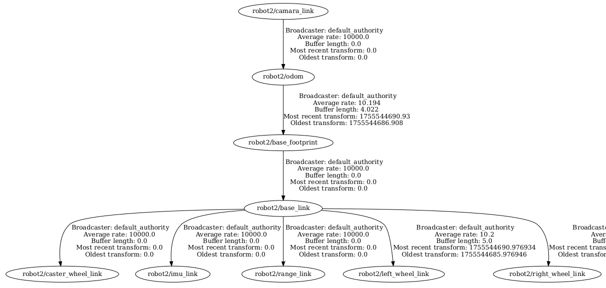
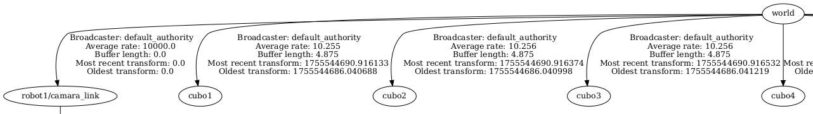
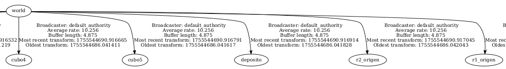

# MANEJO MULTIROBOT CON ROS 2

- En este repositorio se utiliza ros 2 para controlar 2 robots moviles diferenciales y 2 robots cilindricos.
- Se requiere de una camara para su funcionamiento.
- El programa se probo su funcionamiento en un procesador i7.

## Requisitos
[micro-ROS-Agent](https://github.com/micro-ROS/micro-ROS-Agent.git "micro-ROS-Agent")

## Codigo de ejecucion
 ### Camara
    killall gvfs-gphoto2-volume-monitor gvfsd-gphoto2
    sudo modprobe v4l2loopback devices=1 video_nr=10 card_label="VirtualCam"
    ls -l /dev/video10
    gphoto2 --stdout --capture-movie | ffmpeg -i - -vcodec rawvideo -pix_fmt yuv420p -threads 0 -f v4l2 /dev/video10

### Ejecución del programa principal
    colcon build --symlink-install
    source install/local_setup.bash
    ros2 launch robot_movil full_system.launch.py

## Sistemas de referencia

## Interfaz grafica

## Behavior Tree

## Detección de los robots, cubos, depositos y origenes

## Proyecto basado
[Differential drive robot using ROS2 and ESP32](https://github.com/amalshaji4540/diffdrive_ws.git "Differential drive robot using ROS2 and ESP32")

